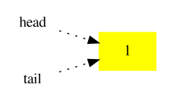
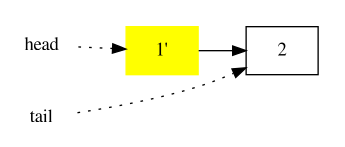
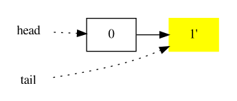

# Terravalet

A tool to help with advanced, low-level [Terraform](https://www.terraform.io/) operations:

- Rename resources within the same Terraform state, with optional fuzzy match.
- Move resources from one Terraform state to another.
- Import existing resources into Terraform state.

**DISCLAIMER Manipulating Terraform state is inherently dangerous. It is your responsibility to be careful and ensure you UNDERSTAND what you are doing**.

## Status

This is BETA code, although we already use it in production.

The project follows [semantic versioning](https://semver.org/). In particular, we are currently at major version 0: anything MAY change at any time. The public API SHOULD NOT be considered stable.

## Overall approach and migration scripts

The overall approach is for Terravalet to generate migration scripts, not to perform any change directly. This for two reasons:

1. Safety. The operator can review the migration scripts for correctness.
2. Gitops-style. The migration scripts are meant to be stored in git in the same branch (and thus same PR) that performs the Terraform changes and can optionally be hooked to an automatic deployment system.

Terravalet takes as input the output of `terraform plan` for each involved root module and generates one UP and one DOWN migration script.

### Remote and local state

At least until Terraform 0.14, `terraform state mv` has a bug: if a remote backend for the state is configured (which will always be the case for prod), it will remove entries from the remote state but it will not add entries to it. It will fail silently and leave an empty backup file, so you will loose your state.

For this reason Terravalet operates on local state and leaves to the operator the task of performing `terraform state pull` and `terraform state push`.

### Terraform workspaces

Be careful when using Terraform workspaces, since they are invisible and persistent global state :-(. Remember to always explicitly run `terraform workspace select` before anything else.

## Install

### Install from binary package

1. Download the archive for your platform from the [releases page](https://github.com/Pix4D/terravalet/releases).
2. Unarchive and copy the `terravalet` executable to a directory in your `$PATH`.

### Install from source

1. Install [Go](https://golang.org/).
2. Install [Task](https://taskfile.dev/).
3. Run `task`:
   ```
   $ task test build
   ```
4. Copy the executable `bin/terravalet` to a directory in your `$PATH`.

## Usage

There are three modes of operation:

- [Rename resources](#rename-resources-within-the-same-state) within the same Terraform state, with optional fuzzy match.
- [Move resources](#-move-resources-from-one-state-to-another) from one Terraform state to another.
- [Import existing resources](#-import-existing-resources) into Terraform state.

they will be explained in the following sections.

You can also look at the tests and in particular at the files below [testdata/](testdata) for a rough idea.

# Rename resources within the same state

Only one Terraform root module (and thus only one state) is involved. This actually covers two different use cases:

1. Renaming resources within the same root module.
2. Moving resources to/from a non-root Terraform module (this will actually _rename_ the resources, since they will get or lose the `module.` prefix).

## Collect information and remote state

```
$ cd $ROOT_MODULE
$ terraform workspace select $WS
$ terraform plan -no-color 2>&1 | tee plan.txt

$ terraform state pull > local.tfstate
$ cp local.tfstate local.tfstate.BACK
```

The backup is needed to recover in case of errors. It must be done now.

## Generate migration scripts: exact match, success

Take as input the Terraform plan `plan.txt` (explicit) and the local state `local.tfstate` (implicit) and generate UP and DOWN migration scripts:

```
$ terravalet rename \
    --plan plan.txt --up 001_TITLE.up.sh --down 001_TITLE.down.sh
```

## Generate migration scripts: exact match, failure

Depending on _how_ the elements have been renamed in the Terraform configuration, it is possible that the exact match will fail:

```
$ terravalet rename \
    --plan plan.txt --up 001_TITLE.up.sh --down 001_TITLE.down.sh
match_exact:
unmatched create:
  aws_route53_record.private["foo"]
unmatched destroy:
  aws_route53_record.foo_private
```

In this case, you can attempt fuzzy matching.

## Generate migration scripts: fuzzy match

**WARNING** Fuzzy match can make mistakes. It is up to you to validate that the migration makes sense.

If the exact match failed, it is possible to enable [q-gram distance](https://github.com/dexyk/stringosim) fuzzy matching with the `-fuzzy-match` flag:

```
$ terravalet rename -fuzzy-match \
    --plan plan.txt --up 001_TITLE.up.sh --down 001_TITLE.down.sh
WARNING fuzzy match enabled. Double-check the following matches:
 9 aws_route53_record.foo_private -> aws_route53_record.private["foo"]
```

## Run the migration script

1. Review the contents of `001_TITLE.up.sh`.
2. Run it: `sh ./001_TITLE.up.sh`

## Push the migrated state

1. `terraform state push local.tfstate`. In case of error, DO NOT FORCE the push unless you understand very well what you are doing.

## Recovery in case of error

Push the `local.tfstate.BACK`.

# Move resources from one state to another

Two Terraform root modules (and thus two states) are involved. The names of the resources stay the same, but we move them from one root module to another.

## Understanding move-after and move-before

Consider root environment (name `1`), represented as list element:



There are two ways to split it:

1. By putting some of its contents AFTER itself.
  
2. By putting some of its contents BEFORE itself.
  

Move AFTER is more frequent and easier to reason about.

On the other hand, you will know when you need to move BEFORE `terraform plan` in the BEFORE module (1' in the figure above) will fail with a message similar to this one:

```
Error: Unsupported attribute
│
│ on main.tf line 11, in resource "null_resource" "res2":
│ 11:     dep = data.terraform_remote_state.prepend_p0.outputs.res1_id
│ data.terraform_remote_state.prepend_p0.outputs is object with 1 attribute "pet"
│
│ This object does not have an attribute named "res1_id".
╵
```

The error is because we didn't run terraform apply in `p0`, so `p0.outputs` doesn't have yet the attribute `res1_id`.

When this happens and you convince yourself that this is expected and not an error on your part, you can still move the state, by using command `move-before`.

## Collect information and remote state

Perform all operations in `topdir`, the directory containing the two root modules.

Something like:

```
topdir/
    BEFORE/    <== root module
    AFTER/     <== root module
```

```
$ terraform -chdir=BEFORE state pull > BEFORE.tfstate
$ terraform -chdir=AFTER  state pull > AFTER.tfstate
```

```
$ terraform -chdir=BEFORE plan -no-color > BEFORE.tfplan   # this for any move
$ terraform -chdir=AFTER  plan -no-color > AFTER.tfplan    # this ONLY for move-before
```

```
$ cp BEFORE.tfstate BEFORE.tfstate.BACK
$ cp AFTER.tfstate AFTER.tfstate.BACK
```

The backups are needed to recover in case of errors. They must be done now.

## Generate migration scripts

Take as input the one or two Terraform plans (BEFORE.tfplan and AFTER.tfplan) and the two state files (BEFORE.tfstate and AFTER.tfstate) and generate the 01-migrate-foo_up.sh and 01-migrate-foo_down.sh migration scripts.

If move-after:

```
$ terravalet move-after  --script=01-migrate-foo --before=BEFORE --after=AFTER
```

If move-before:

```
$ terravalet move-before --script=01-migrate-foo --before=BEFORE --after=AFTER
```

## Run the migration script

1. Review the contents of `01-migrate-foo_up.sh`.
2. Run it: `sh ./01-migrate-foo_up.sh`

## Push the migrated states

In case of error, DO NOT FORCE the push unless you understand very well what you are doing.

```
$ terraform -chdir=BEFORE state push - < BEFORE.tfstate
$ terraform -chdir=AFTER  state push - < AFTER.tfstate
```

## Recovery in case of error

Push the two backups:

```
$ terraform -chdir=BEFORE state push - < BEFORE.tfstate.BACK
$ terraform -chdir=AFTER  state push - < AFTER.tfstate.BACK
```

# Import existing resources

The `terraform import` command can import existing resources into Terraform state, but requires to painstakingly write by hand the arguments, one per resource. This is error-prone and tedious.

Thus, `terravalet import` creates the import commands for you.

You must first add to the Terraform configuration the resources that you want to import, and then import them: neither `terraform` nor `terravalet` are able to write Terraform configuration, they only add to the Terraform state.

Since each Terraform provider introduces its own resources, it would be impossible for Terravalet to know all of them. Instead, you write a simple [resource definitions file](#writing-a-resource-definitions-file), so that Terravalet can know how to proceed.

For concreteness, the examples below refer to the [Terraform GitHub provider](https://registry.terraform.io/providers/integrations/github/latest/docs).

## Generate a plan in JSON format

terraform plan:

```
$ cd $ROOT_MODULE
$ terraform plan -no-color 2>&1 -out plan.txt
$ terraform show -json plan.txt | tee plan.json
```

## Generate import/remove scripts

Take as input the Terraform plan in JSON format `plan.json` and generate UP and DOWN import scripts:

```
$ terravalet import \
    --res-defs  my_definitions.json \
    --src-plan  plan.json \
    --up import.up.sh --down import.down.sh
```

## Review the scripts

1. Ensure that the **parent** resources are placed at the top of the `up` script, followed by their **children**.
2. Ensure that the **child** resources are placed at the top of the `down` script, followed by their **parents**.
3. Ensure the correctness of parameters.

NOTE: The script modifies the remote state, but it is not dangerous because it only imports new resources if they already exist and it doesn't create or destroy anything.

Terraform will try to import as much as possible, if the corresponding address in state doesn't exist yet, it means it should be created later using `terraform apply`, actually the resource is in `.tf` configuration, but not yet in real world.

## Run the import script

```
sh ./import.up.sh
```

### Example

Here is a new plan, scripts have been already generated:

```
 $ terraform plan
 .....
 Plan: 6 to add, 0 to change, 0 to destroy.
```
These are new resources, let's run the import script and run the plan again:

```
$ sh import.up.sh
module.github.github_repository.repos["test-import-gh"]: Importing from ID "test-import-gh"...
module.github.github_repository.repos["test-import-gh"]: Import prepared!
  Prepared github_repository for import
module.github.github_repository.repos["test-import-gh"]: Refreshing state... [id=test-import-gh]

Import successful!
.....
```

During the run the following error can happen:

```
Error: Cannot import non-existent remote object

While attempting to import an existing object to
github_team_repository.all_teams["test-import-gh.integration"], the provider
detected that no object exists with the given id. Only pre-existing objects
can be imported; check that the id is correct and that it is associated with
the provider's configured region or endpoint, or use "terraform apply" to
create a new remote object for this resource.
```

In this specific case the out-of-band resource didn't have a setting yet about teams, so it's normal.

Next plan should be different:

```
$ terraform plan
.....
Plan: 3 to add, 2 to change, 0 to destroy.
```

In conclusion, the plan now is close to real resources states and terraform is now aware of them.
In every case plan doesn't contain any `destroy` sentence.

## Rollback

Run `import.down.sh` script that remove the same resources from terraform state that have been imported with `import.up.sh`.

## Writing a resource definitions file

Terravalet doesn't know anything about resources, it just parses the plan and uses the resources configuration file passed via the flag `res-defs`. An example can be found in [testdata/import/terravalet_imports_definitions.json](testdata/import/terravalet_imports_definitions.json).

The idea is to tell Terravalet where to search the data to build the up/down scripts. The correct information can be found on the [specific provider documentation](https://registry.terraform.io/browse/providers). Under the hood, Terravalet matches the parsed plan and resources definition file.

1. The JSON resources definition is a map of resources type objects identified by their own name as a key.
2. The resource type object has an optional `priority`: import statement for that resource must be placed at the top of up.sh and at the bottom of down.sh (resources that must be imported before others).
3. The resource type object has an optional `separator`: in case of multiple arguments it is mandatory and it will be used to join them. Using the example below, `tag, owner` will be joined into the string `<tag_value>:<owner_value>`.
4. The resource type object must have `variables`: a list of fields names that are the keys in the plan to retrieve the correct values building the import statement. Using the example below, Terravalet will search for keys `tag` and `owner` in terraform plan for that resource.

```json
{
  "dummy_resource1": {
    "priority": 1,
    "separator": ":",
    "variables": [
      "tag",
      "owner"
    ]
  }
}
```

## Error cases

Ignorable errors:

1. Resource X doesn't exists yet, it resides only in new terraform configuration.
2. Resource X exists, but depends on resource Y that has not been imported yet (should be fine setting the priority).

NON ignorable errors:

1. Provider specific argument ID is wrong.

# Making a release

## Setup

1. Install [github-release](https://github.com/github-release/github-release).
2. Install [gopass](https://github.com/gopasspw/gopass) or equivalent.
3. Configure a GitHub token:
    * Go to [Personal Access tokens](https://github.com/settings/tokens)
    * Click on "Generate new token"
    * Select only the `repo` scope
4. Store the token securely with a tool like `gopass`. The name `GITHUB_TOKEN` is expected by `github-release`
   ```
   $ gopass insert gh/terravalet/GITHUB_TOKEN
   ```

## Each time

1. Update [CHANGELOG](CHANGELOG.md)
2. Update this README and/or additional documentation.
3. Commit and push.
4. Begin the release process with
   ```
   $ env RELEASE_TAG=v0.1.0 gopass env gh/terravalet task release
   ```
5. Finish the release process by following the instructions printed by `task` above.
6. To recover from a half-baked release, see the hints in the [Taskfile](Taskfile.yml).

# History and credits

The idea of migrations comes from [tfmigrate](https://github.com/minamijoyo/tfmigrate). Then this blog [post](https://medium.com/@lynnlin827/moving-terraform-resources-states-from-one-remote-state-to-another-c76f8b76a996)  made me realize that `terraform state mv` had a bug and how to workaround it.

# License

This code is released under the MIT license, see file [LICENSE](LICENSE).
